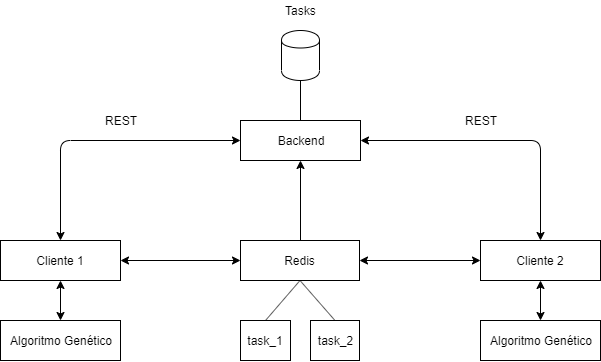

# APS Sistemas Distribuídos

O trabalho consiste em um algoritmo genético distribuído entre vários clientes. Cada cliente pode criar e participar de "tasks", as quais são instâncias da execução de determinado algoritmo. Então, cada cliente executa o algoritmo localmente e informa suas melhores soluções para os demais hosts utilizando o Redis. Sempre que um cliente recebe uma boa solução de outro cliente, existe uma chance dele incorporar essa solução em sua população. A execução termina quando o cliente desejar ou quando algum outro cliente encontrar a melhor solução para a task em execução.

Foi criado um servidor que disponibiliza uma interface REST para criar e listar as tasks, as quais são armazenadas em um banco SQLite. Além disso, o servidor também é um subscriber do Redis, salvando as melhores soluções em uma tabela do banco, para que novos clientes recebam uma lista das melhores soluções encontradas até o momento.

Como demonstração, foi criado um algoritmo genético simples para encontrar determinadas palavras ou frases. O algoritmo gera conjuntos de letras aleatórios de mesmo tamanho do texto alvo, e então executa os passos de um algorítmo genético para encontrar a solução. O número de letras correspondentes na mesma posição entre os indivíduos gerados e o texto alvo é utilizado como função de "fitness". A arquitetura do algorítmo foi pensada de forma a ser facilmente adaptada para outros problemas, porém foi escolhido um algoritmo simples para a demonstração por esse não ser o foco do trabalho.

## Arquitetura

## Tecnologias utilizadas

- Docker
- Node
- SQLite
- Redis
- Python